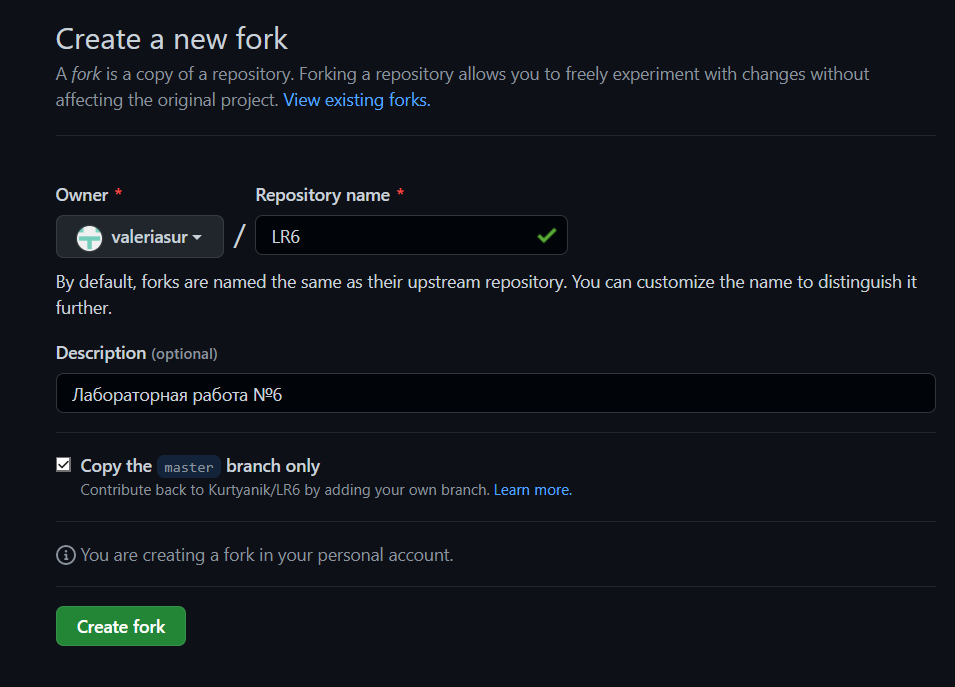

# LR6
Лабораторная работа №6
## Цель лабораторной работы
изучение базовых возможностей системы управления версиями, опыт работы с Git Api, опыт работы с локальным и удаленным репозиторием.
## Ход работы
* Делаем копию в личное хранилище 
    
* Делаем настройку клиента git  
    
* Добавляем файл через интерфейс GitHub, делаем первый комит, обновляем локальный репозиторий 
        
* Клонируем свой личный удалённый репозиторий на компьютер 
    
* Выводим всю историю
    
* Создаем новую ветку
    
* Сливаем две ветки в одну
    
* Удаляем побочную ветку после успешного слияния
     
* Создаем комит, который будем удалять
     
* Удаляем этот комит
     
* Финальная история изменений
    